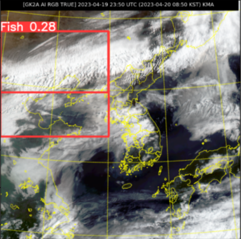
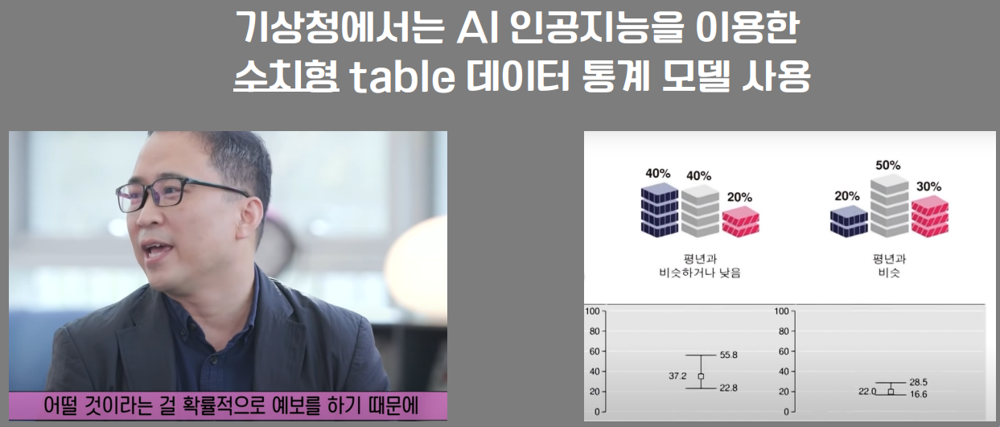
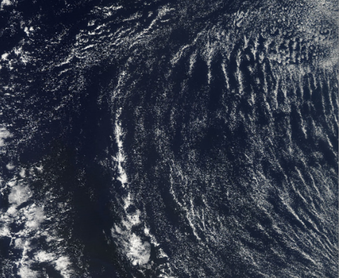
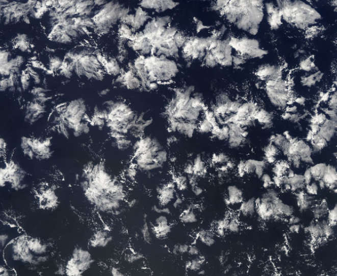
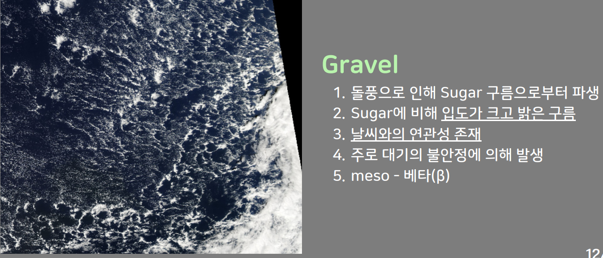
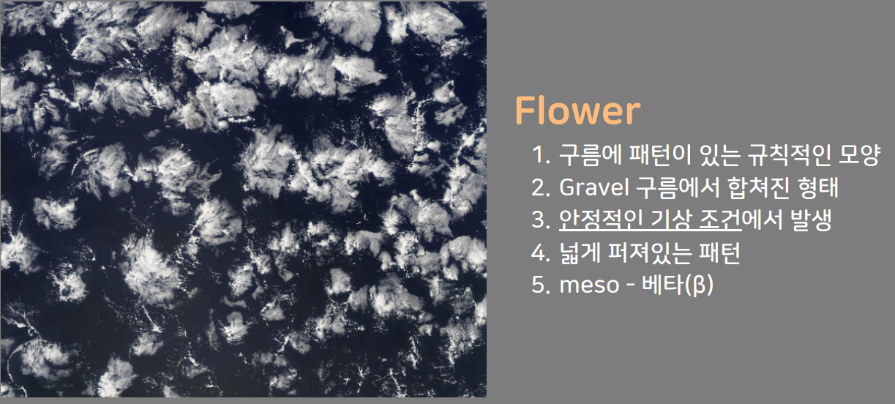
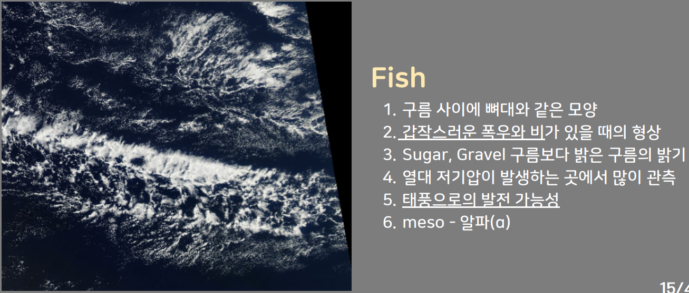

# ☁️ 구름 패턴 분류 모델 ☁️

 

 
위성사진에서 강수확률과 관련된 구름을 디텍팅하여 기상예보 분석을 보조해주는 딥러닝 모델 설계 및 개발 레포입니다.

## 👨🏿‍🤝‍👨🏿Member
[노아윤](https://github.com/ayun3738) | [유미리](https://github.com/Yu-Miri) |[이기준](https://github.com/gijun0725)
:-: | :-: | :-: 
||

## 📋Index
- [📝 Project Summary](#📝project-summary)
- [👀 데이터셋 ](#👀-데이터셋 )
- [⚙️ Modeling](#⚙️-modeling)
- [🔍 Conclusion](#🔍-conclusion)
- [⚒️ Appendix](#⚒️-appendix)

## 📝Project Summary
- 개요
  > 위성사진에서 구름의 패턴을 빠르게 디텍팅하여 기상예보 분석을 보조해줄 수 있는 딥러닝 모델 설계
- 목적 및 배경

    > 기상청에서는 AI 인공지능을 이용한 수치형 table 데이터 통계모델을 사용하는 것으로 알려져 있습니다. 하지만 초단기 일기예보는 10분마다 들어오는 자료들을 분석해야합니다. 자동화된 자료들 사이에서도 결국 종합적인 분석은 예보관이 합니다.

    출처 : https://www.youtube.com/watch?v=bMpBXqjuGlI

 
 

    
  > 위성사진 상에서 구름의 형태에 따라 강수량에 영향을 줄 수 있다는 보고와 함께 정성적으로 라벨링된 데이터셋을 발견하게 됐습니다. 이 데이터셋을 활용하여 Object Detection 모델을 학습시킨다면, 구름의 형태에 따라 강수량의 유추가 가능할 수 있게 구름의 모양을 실시간으로 디텍팅할 수 있습니다.

  출처 : https://rmets.onlinelibrary.wiley.com/doi/full/10.1002/qj.3662

 💡 우리의 AI 모델을 사용한다면,
  1. 예보관에게 가시적으로 상황을 알려줄 수 있습니다. 경력이 상당한 예보관이나 기상학자분들은 바로 구름형태를 보고 빠른 판단을 할 수 있겠지만, 신입 예보관 등의 상황에 지침으로 구름의 형태를 실시간 모니터링하며 변하는 모습과 흐르는 방향을 볼 수 있습니다.
  2. 구간별 지역별 디텍팅 카운팅이나 디텍팅 확률 등을 수치형 table 데이터의 자료로 추가 제공하여 통계모델을 더 깊이 있게 활용하는 보조로서의 가치가 있을 것이라 생각했습니다.
  
- 모델 설계
  > 위성사진을 input 이미지로 받았을 때, 가능성 있는 위치에 어떤 패턴인지 알아야 하기 때문에 Object Detection이나 Segmentation 기법을 이용해 구름 패턴을 파악하기로 설계했습니다. Object Detection이 통상적으로 잘 되고 튜닝이 용이한 YOLO의 버전들을 확인하며 모델을 결정하기로 했습니다. 가시적으로 패턴을 잘 디텍팅하는지 확인하면서, mAP를 기준으로 모델을 선정했습니다.

- 활용 장비 및 재료
  - 라이브러리 : pytorch, sklearn, OpenCV, roboflow, ultralytics
  - 개발 및 협업 툴 : python, colab notebook, vscode(windows)

## 👀 데이터셋 

초기 모델 설계 과정에서 결정한 YOLO를 학습시키기 위해 라벨링된 위성사진이 필요합니다.

### NASA WORLD VIEW
- 출처 : [cloud types Computer Vision Project](https://universe.roboflow.com/roboflow-100/cloud-types)
- 소개 : 2100 x 1400의 5050장의 나사에서 특정 위치에서 지속적으로 찍은 인공위성 사진입니다. 인공위성 사진이다 보니 이미지 노이즈로 태양빛이나 인공위성 지지대가 사진에 일부 포함되어 있습니다. 라벨당 2000장 이상의 충분한 데이터양이라고 판단하고 학습에 이용하기로 했습니다.
- 라벨 : 총 4가지 패턴으로 구성됐으며, segmentation 라벨링은 없고 bounding box만 라벨링 되어 있습니다.

 

> 주로 낮은 고도에서 관측되며 설탕을 뿌린 것 같이 여러 입자로 이루어진 미세 구름형태입니다. 강수와 연관성이 거의 없습니다. 

 

> 주로 대기의 불안정에 의해 발생하여 sugar구름으로부터 합쳐져 파생된 입도가 크고 밝은 구름입니다. 강수 연관성이 있습니다.

 

> Gravel 구름이 여러 덩어리로 뭉쳐져 넓게 퍼져있습니다. 규칙적인 모양을 띄며 기상 조건은 안정적입니다.

 

> 구름사이에 뼈대가 있는 듯한 모양이며 열대 저기압이 발생하는 곳에서 많이 관측되고 갑작스러운 폭우나 비가 예상되며 태풍으로의 발전 가능성도 있습니다.

- 전체 라벨 분포 : [sugar - 3408(31.7%), gravel - 2674(24.9%), flower - 2141(19.9%), fish - 2528(23.5%) ] => 각 라벨당 2000장 이상의 넉넉한 데이터양이라고 판단했습니다.

## ⚙️ Modeling

YOLO의 다양한 버전, 다양한 이미지 전처리 방식으로 스코어를 확인하며 문제점을 파악하고 개선해 나갔습니다.

### 1. 데이터 전처리

>- KorNLI : KorNLI 데이터에서 일치하는 문장 두개와 무작위의 반대의미 문장까지 3가지 문장쌍을 데이터셋으로 구성하는 Pairing 방식을 사용하여 구상했습니다.

 

>- KorSTS : KorSTS 데이터에서 0~5의 점수를 **0 ~ 1**으로 normalization 했습니다.

 

### 2. 데이터 전처리(크롤링 custom 데이터)

>- casenote에서 크롤링한 판례문들의 판례문에서 '이유' 부분의 텍스트가 판례의 내용을 담고 있다고 판단하여 그부분을 .csv 파일로 저장했습니다,

 

>- 이후 한글 외의 문자, 숫자를 제거하고, 데이터 특성상 판결문의 글머리(ex. 가, 나, 다)와 형식적 단어(ex. 사건개요) 등의 불용어 제거했습니다.

 

>- 그 뒤 하나의 판결문에 대해 문장들을 분리하여 각각의 cosine 유사도를 포함한 데이터쌍을 구상하여 KorSTS에서의 값들처럼 **0 ~ 1**사이의 값으로 구성했습니다.

 

>- 기존 참고한 Sentence BERT 학습 코드에서 판결문 관련 custom 데이터를 추가함으로 유사 판결문을 더 잘 판별할 것으로 기대하였고, transformer도 바꿔가며 학습을 진행했습니다.
>- 트레이닝 코드 : [training_last.py](training_last.py), [data_util.py](data_util.py)
